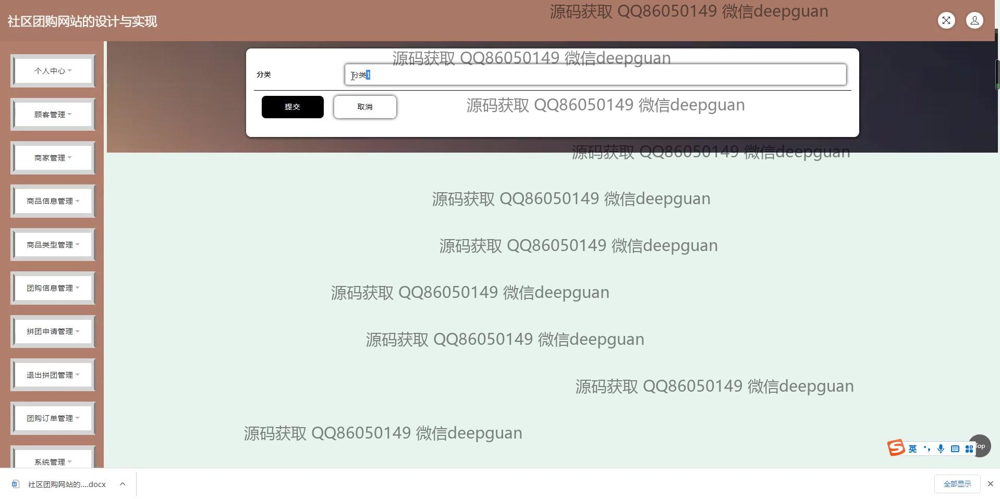
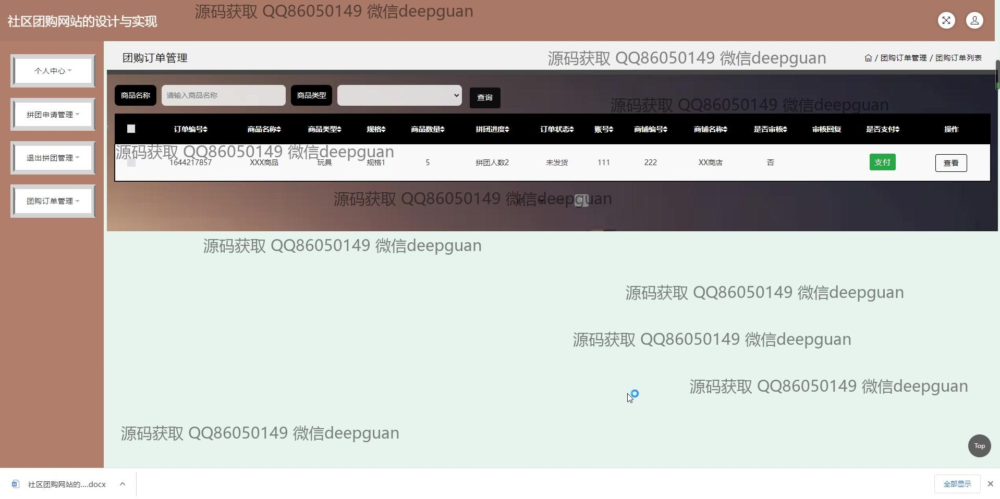

<h1 align="center">社区团购网站的设计与实现+jsp</h1>

## 简介
社区团购网站：角色分为管理员、用户；用户注册、商家注册、商品管理、订单管理、拼团申请、公告信息管理、登录注册功能，基于SSM框架开发，实现高效便捷的交互界面。    --计算机毕业设计源码；毕设源码；java毕业设计源码

## 联系方式

<h3 align="center">获取完整代码与数据库文件 + 微信：deepguan QQ: 86050149 QQ群: 783742310</h3>

<h3 align="center">可帮忙远程部署 包运行成功！提供远程部署、修改代码、设计文档指导、代码讲解等服务！</h3>

## 功能介绍（完整见运行截图）
管理员：  
基本功能：登录、注册、退出，管理模块切换。  
商品管理：商品信息的添加、修改、删除，商品搜索，批量管理，商品类型分类管理。  
订单管理：订单信息查看与编辑，订单查询、发货、物流管理，拼团申请与退出管理。  
用户管理：顾客信息管理，包括账户新增、修改、删除及批量操作。  
网站功能：公告信息管理，查看、编辑、删除公告内容。  

商家：  
基本功能：商家账户登录、注册、信息修改。  
商品管理：商铺商品信息录入与更新，包括商品图片上传、价格、库存等设置。  
订单管理：查看订单状态，处理顾客订单，包括订单发货和评论管理。  

用户：  
基本功能：顾客账号注册、登录、个人信息管理。  
商品功能：商品搜索与浏览，查看商品详情，加入购物车，参与拼团或单独购买，在线支付。  
订单功能：订单状态查询，包括未支付、已支付、已发货等状态，申请退款与订单删除。  
个人中心：地址管理、订单记录查询、收藏管理。  

访客：  
网站首页：查看推荐商品与最新公告，轮播图展示重要信息，浏览商品列表与详细信息。  
导航功能：通过导航栏访问商品信息、团购信息、公告信息以及自然风光等内容。

## 运行截图

本代码来源于网络,仅供学习参考使用!

